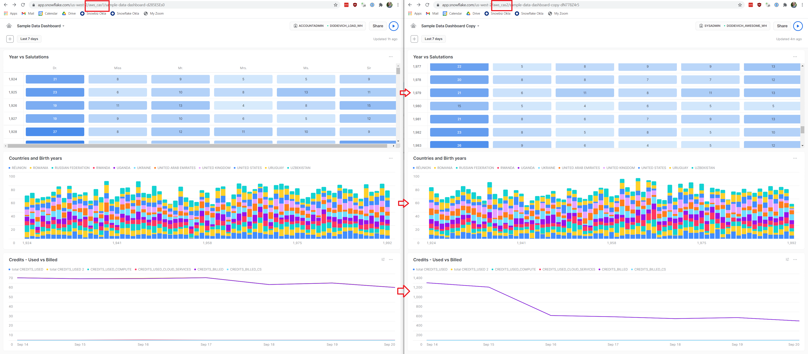
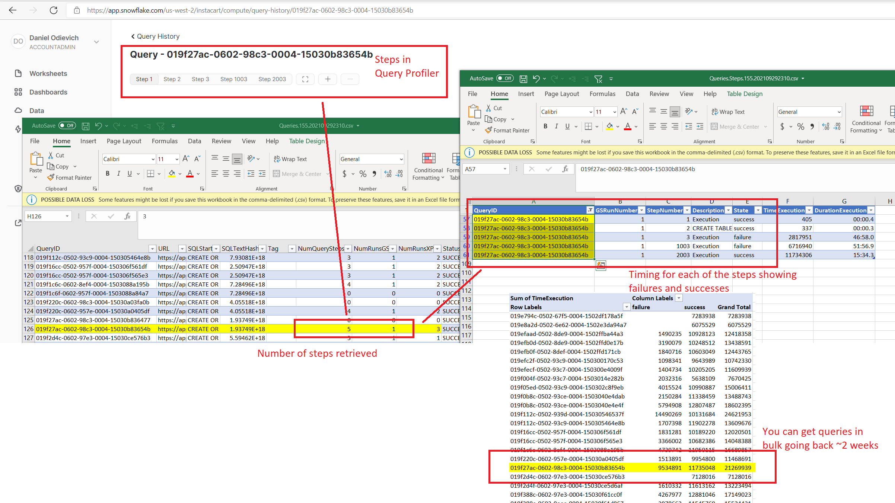

# Snowflake Snowsight Extensions
Snowflake Snowsight Extensions wrap Snowsight features that do not have API or SQL alternatives, such as manipulating Dashboards and Worksheets, and retrieving Query Profile and step timings.

Created and developed by Daniel Odievich, Senior Solution Architect at Snowflake Professional Services.
This repo is maintained by group of internal Snowflake associates. Please log issues in this repository.
General questions can be directed to (michael.ybarra@snowflake.com)

| :exclamation:        | This project is not an officially supported product of Snowflake. Use at your own risk.     |
|---------------|:------------------------|

# Example
## Copied dashboard

[Full Size](docs/CopiedDashboard.png?raw=true)

# Install
All binaries are located in [Releases](https://github.com/Snowflake-Labs/sfsnowsightextensions/releases)

##### NOTE: You can use the [Download-SFBinaries](https://github.com/Snowflake-Labs/sfsnowsightextensions/blob/main/Download-SFBinaries.ps1) file to automate the download and setup of your session like so:

```pwsh
pwsh -File ./Download-SFBinaries.ps1
```

## Install PowerShell
Install Powershell 7 from [Powershell GitHub Releases](https://github.com/PowerShell/PowerShell/releases) or [Powershell Landing page](https://docs.microsoft.com/en-us/powershell/scripting/install/installing-powershell).

## Install on Windows
Download `SnowflakePS.win.<version>.zip`, save and extract the archive.

Open your terminal ([Windows Terminal](https://github.com/microsoft/terminal) is Recommendated) with Powershell.

Run this command to load Snowflake Powershell module:
```
PS > Import-Module <path to where you extracted binaries>\SnowflakePS.psd1
```

## Install on OSX
Download `SnowflakePS.osx.<version>.zip` but do not extract the archive yet.

Open your terminal ([iTerm2](https://iterm2.com/) is recommended) and change working directory to where you saved the file to. 

To avoid OS security warnings, run this command in the shell to remove the quarantine attribute:
```
xattr -d com.apple.quarantine SnowflakePS.*.zip
```

Now extract the archive.

Start Powershell via `pwsh` command.

Run this command to load Snowflake Powershell module:
```
PS > Import-Module <path to where you extracted binaries>/SnowflakePS.psd1
```

## Install on Linux
Download `SnowflakePS.linux.<version>.zip`, save and extract the archive.

Open your terminal and start Powershell via `pwsh` command.

Run this command to load Snowflake Powershell module:
```
PS > Import-Module <path to where you extracted binaries>/SnowflakePS.psd1
```

## Add to PowerShell profile
- Start Powershell using the command for your specific operating system
- Run ``$profile`` to get the path of your powershell profile
- Check if the profile exists by cd into the profile path. If it does not exit then
manually create the profile file in the path specified by ``$profile`` command or run

```
New-Item -type file -path $profile -force
```
- Add Connect Command to PowerShell profile
```
 echo "function snowsightext(){Import-Module '~/<PATH TO FILE>/SnowflakePS.psd1' && Connect-SFApp -Account <YourSnowFlakeAccount> -Credential (Get-Credential)}">>$profile
 exit
```
- You can now start the Powershell and simply run
```
snowsightext
```

# Use
You can use this module directly in the shell or by scripting in ps1 files.

## List of Available Commands
Get all available commands:
```
PS > Get-Command -Module SnowflakePS
```

The output should look like this:
```
CommandType     Name                                               Version    Source
-----------     ----                                               -------    ------
Cmdlet          Connect-SFApp                                      2022.6.2.0 SnowflakePS
Cmdlet          Get-SFDashboards                                   2022.6.2.0 SnowflakePS
Cmdlet          Get-SFFilters                                      2022.6.2.0 SnowflakePS
Cmdlet          Get-SFFolders                                      2022.6.2.0 SnowflakePS
Cmdlet          Get-SFQueryProfile                                 2022.6.2.0 SnowflakePS
Cmdlet          Get-SFWorksheets                                   2022.6.2.0 SnowflakePS
Cmdlet          Invoke-SFDashboard                                 2022.6.2.0 SnowflakePS
Cmdlet          Invoke-SFWorksheet                                 2022.6.2.0 SnowflakePS
Cmdlet          New-SFDashboard                                    2022.6.2.0 SnowflakePS
Cmdlet          New-SFFilter                                       2022.6.2.0 SnowflakePS
Cmdlet          New-SFWorksheet                                    2022.6.2.0 SnowflakePS
Cmdlet          Remove-SFDashboard                                 2022.6.2.0 SnowflakePS
Cmdlet          Remove-SFFilter                                    2022.6.2.0 SnowflakePS
Cmdlet          Remove-SFWorksheet                                 2022.6.2.0 SnowflakePS
```

## Connect-SFApp
This command authenticates user to Snowsight and returns authentication token that must be passed to the other commands. 

The resulting is fairly long-lived and can be saved to file and reused without having to reauthenticate.

```
PS > Connect-SFApp -?

NAME
    Connect-SFApp

SYNTAX
    Connect-SFApp [-Account] <string> [[-MainAppURL] <string>] [-UserName] <string> [-Password] <securestring> [<CommonParameters>]

    Connect-SFApp [-Account] <string> [[-MainAppURL] <string>] [-Credential] <pscredential> [<CommonParameters>]

    Connect-SFApp [-Account] <string> [[-MainAppURL] <string>] [-UserName] <string> [-SSO] [<CommonParameters>]
```

### Connect-SFApp Parameter - Account
You must pass full name of the account from the URL https://`<account_name>`.snowflakecomputing.com> as described in [Specifying Region Information in Your Account Hostname](https://docs.snowflake.com/en/user-guide/intro-regions.html#specifying-region-information-in-your-account-hostname):

Account URL | Account Name
-- | --
https://aws_cas1.snowflakecomputing.com | aws_cas1
https://customer.canada-central.azure.snowflakecomputing.com | customer.canada-central.azure
https://sfpscogs_dodievich_sso.west-us-2.azure.snowflakecomputing.com | sfpscogs_dodievich_sso.west-us-2.azure
https://something.us-east-1.privatelink.snowflakecomputing.com | something.us-east-1.privatelink.snowflakecomputing.com

PrivateLink URLs are supported ONLY if you add `.snowflakecomputing.com` at the end, but may still not work for you if you have network access policies blocking the client IP addresses.

### Connect-SFApp Parameter - MainAppURL
Optional parameter. By default it is https://app.snowflake.com, which is a production environment of Snowsight. 

Pass a real URL to point at a different endpoint (QA/DEV), if you have access to it.

### Connect-SFApp Parameter - UserName
Username of user to authenticate.

### Connect-SFApp Parameter - Password
Password of user as secure string.

### Connect-SFApp Parameter - Credential
Username/password combination of user to authenticate as PSCredential.

### Connect-SFApp Parameter - SSO
When specified, browser authentication with SSO provider is used.

### Connect-SFApp - Prompt for Username and Password
You will get prompted for username and password:
```
PS > $appContext = Connect-SFApp -Account myaccount

cmdlet Connect-SFApp at command pipeline position 1
Supply values for the following parameters:
(Type !? for Help.)
UserName: myusername
Password: ************
```

### Connect-SFApp - Prompt for Credentials
You will get prompted for username and password:
```
PS > $appContext = Connect-SFApp -Account aws_cas1 -Credential (Get-Credential)

PowerShell credential request
Enter your credentials.
User: myusername
Password for user myusername: **********
```

### Connect-SFApp - Pass Username and Password
Pass username and password and skip all prompts:

```
PS > $appContext = Connect-SFApp -Account aws_cas1 -UserName myusername -Password (ConvertTo-SecureString -String "supersecret" -AsPlainText)
```

Obviously your password is in clear text, so use carefully.

### Connect-SFApp - Use SSO
You must specify same username as the one you will use to authenticate with SSO:
```
PS > $appContext = Connect-SFApp -Account aws_cas1 -UserName myusername -SSO
```

### Connect-SFApp - Get Authentication Token
Authenticate with credential prompt and store resulting authentication token in `$appContext` variable:
```
PS > $appContext = Connect-SFApp -Account aws_cas1

cmdlet Connect-SFApp at command pipeline position 1
Supply values for the following parameters:
(Type !? for Help.)
UserName: dodievich
Password: ************
Account 'aws_cas1' in region 'us-west-2' is accessible at 'https://aws_cas1.snowflakecomputing.com' and served by application server 'https://apps-api.c1.us-west-2.aws.app.snowflake.com'
Authenticating user 'dodievich' in account 'aws_cas1'
Validating master token for user 'dodievich' in account 'aws_cas1'
Converting redirect token to authentication token for user 'dodievich in account 'aws_cas1'
Successfully authenticated 'dodievich' (87577248877) in account 'aws_cas1' (257859291703)
Execution took 00:00:01.9017100 (1901 ms)
```

View authentication token:
```
PS > $appContext

AppServerUrl       : https://apps-api.c1.us-west-2.aws.app.snowflake.com
AuthTokenSnowsight : user-646f646965766963683a<...>Q==; Path=/; Expires=Tue, 15 Jun 2021 21:04:58 GMT; Max-Age=2419200; HttpOnly; Secure;
                     SameSite=Lax
AuthTokenMaster    : ETMs<...>ILw=
AuthTokenSession   : ETMs<...>==
ClientID           : R/ykyhaxXg8WlftPZd6Ih0Y4auOsVg==
CSRFToken          : 3sm46ggj6Sz
UserID             : 87577248877
UserName           : dodievich
ServerVersion      : 5.17.1
FileSystemSafeName : AppUserContext.aws_cas1.dodievich.json
_CreatedWith       : Snowflake Snowsight Extensions
_CreatedVersion    : 2021.5.18.0
AccountName        : aws_cas1
AccountFullName    : aws_cas1
AccountUrl         : https://aws_cas1.snowflakecomputing.com
OrganizationID     : 257859291703
Region             : us-west-2
```

### Connect-SFApp - Persist Token to File
Save authentication token to file, specifying its name:
```
PS > $appContext.SaveToFile("path/to/folder/authToken_myaccount.json")
```
Save authentication token to folder with the default filename specified by `FileSystemSafeName` property:
```
PS > $appContext.SaveToFolder("path/to/folder")
```
Save authentication token to file using `ConvertTo-JSON` function:
```
PS > $appContext | ConvertTo-JSON | Out-File path/to/folder/with.json
```

### Connect-SFApp - Read Token from File
If you have a saved token in a file, you can read authentication token from it:
```
PS > $appContext = Get-Content -Path path/to/folder/authToken_myaccount.json | ConvertFrom-JSON
```

## Get-SFWorksheets
Returns list of all Worksheets in the Account as an array of Worksheet objects that can be manipulated directly and saved to a file.

```
PS > Get-SFWorksheets -?

NAME
    Get-SFWorksheets

SYNTAX
    Get-SFWorksheets [-AuthContext] <AppUserContext> [<CommonParameters>]
```

### Get-SFWorksheets Parameter - AuthContext
Authentication context from Connect-SFApp command.

### Get-SFWorksheets - Retrieve List of Worksheets
Retrieve the list of Worksheets into `$worksheets` variable:
```
PS > $worksheets = Get-SFWorksheets -AuthContext $appContext
Retrieved 30 worksheets
Execution took 00:00:00.5990264 (599 ms)
```

View the list of Worksheets:
```
PS > $worksheets

WorksheetID   WorksheetName             FolderID   FolderName                AccountName          OwnerUserName   ModifiedUtc            Query
-----------   -------------             --------   ----------                -----------          -------------   -----------            -----
4Ylfm6mqkJB   2021-04-16 1:16pm                                              aws_cas1             DODIEVICH       4/21/2021 11:23:07 PM  test
2zdJ1tNq2xY   Account and SSO                                                aws_cas1             DODIEVICH       4/21/2021 11:25:02 PM  USE ROLE AC…
4zPK3cLsfd4   Azure Blob Integrations                                        aws_cas1             DODIEVICH       4/21/2021 11:25:02 PM  SHOW INTEGR…
4nNfNmxeSHh   Create Roles                                                   aws_cas1             DODIEVICH       4/21/2021 11:25:03 PM  USE ROLE US…
...
```

### Get-SFWorksheets - View Single Worksheet
View details of single Worksheet:
```
PS > $worksheets[0] | Format-List

AccountName        : aws_cas1
AccountFullName    : aws_cas1
AccountUrl         : https://aws_cas1.snowflakecomputing.com
OrganizationID     : 257859291703
Region             : us-west-2
FolderID           :
FolderName         :
OwnerUserID        : 87577248877
OwnerUserName      : DODIEVICH
Version            : 2
URL                : /us-west-2/aws_cas1/w4Ylfm6mqkJB#query
WorksheetID        : 4Ylfm6mqkJB
WorksheetName      : 2021-04-16 1:16pm
StartedUtc         : 4/21/2021 11:23:07 PM
EndedUtc           : 1/1/0001 12:00:00 AM
ModifiedUtc        : 4/21/2021 11:23:07 PM
Role               : SYSADMIN
Warehouse          :
Database           : DODIEVICH_PS_ONBOARD
Schema             : INTRO_DATA_LOADING
Query              : test
FileSystemSafeName : 2021-04-16 1-16pm.4Ylfm6mqkJB
```

### Get-SFWorksheets - Access Worksheet by Internal ID
Convert Worksheets in `$worksheets` array to `$worksheetsHash` hash table:

```
PS > $worksheetsHash = @{}; $worksheets | foreach {$worksheetsHash[$_.WorksheetID] = $_}; $worksheetsHash

Name                           Value
----                           -----
CXCvscvEKJ                     Worksheet: Login and REST History (CXCvscvEKJ) in folder  () in aws_cas1 owned by DODIEVICH(87577248877)
1eGl154YcxE                    Worksheet: Worksheet 6 (1eGl154YcxE) in folder  () in aws_cas1 owned by DODIEVICH(87577248877)
y1s0KO81Zq                     Worksheet: RBAC BCI Environment (y1s0KO81Zq) in folder  () in aws_cas1 owned by DODIEVICH(87577248877)
3MR8KWjzzEg                    Worksheet: KeithShareForDaniel (3MR8KWjzzEg) in folder  () in aws_cas1 owned by DODIEVICH(87577248877)
```

Get Worksheet by ID from `$worksheetsHash` hashtable:
```
PS > $worksheetsHash["CXCvscvEKJ"]

WorksheetID   WorksheetName             FolderID   FolderName                AccountName          OwnerUserName   ModifiedUtc            Query
-----------   -------------             --------   ----------                -----------          -------------   -----------            -----
CXCvscvEKJ    Login and REST History                                         aws_cas1             DODIEVICH       4/21/2021 11:25:04 PM  USE ROLE AC…
```

### Get-SFWorksheets - Save All Worksheets to Local Files
Save all Worksheets to files:
```
PS > $worksheets | foreach {$_.SaveToFolder("path/to/folder")}
```
Save all Worksheets to files using `ConvertTo-JSON` function:
```
PS > $worksheets | foreach {ConvertTo-JSON -Depth 10 -InputObject $_ | Out-File "path/to/folder/$($_.FileSystemSafeName)"}
```

### Get-SFWorksheets - Save Single Worksheet to Local File
Save single Worksheet from `$worksheets` array to file, specifying its name:
```
PS > $worksheets[0].SaveToFile("path/to/folder/myworksheet.json")
```
Save single Worksheet from `$worksheets` array to folder with the default filename specified by `FileSystemSafeName` property:
```
PS > $worksheets[0].SaveToFolder("path/to/folder")
```
Save single Worksheet from `$worksheets` array to file using `ConvertTo-JSON` function:
```
$worksheets[0] | ConvertTo-JSON -Depth 10 | Out-File "path/to/folder/$($worksheets[0].FileSystemSafeName)"
```
Save single Worksheet from `$worksheetsHash` hashtable with ID of `myworksheetid` to a file:
```
$worksheetsHash["myworksheetid"] | ConvertTo-JSON -Depth 10 | Out-File "path/to/folder/$($worksheetsHash["myworksheetid"].FileSystemSafeName)"
```

### Get-SFWorksheets - Get Single Worksheet from Local File
Load Worksheet from file into a variable:

```
PS > $worksheet = Get-Content 'path/to/folder/myworksheet.json' | ConvertFrom-JSON
PS > $worksheet | Format-List

FolderID           :
FolderName         :
OwnerUserID        : 87577248877
OwnerUserName      : DODIEVICH
Version            : 2
URL                : /us-west-2/aws_cas1/w3MR8KWjzzEg#query
WorksheetID        : 3MR8KWjzzEg
WorksheetName      : KeithShareForDaniel
StartedUtc         : 4/21/2021 11:23:08 PM
EndedUtc           : 1/1/0001 12:00:00 AM
ModifiedUtc        : 4/21/2021 11:23:08 PM
Role               : PUBLIC
Warehouse          : KSMITH_ANALYTICS_WH
Database           : SNOWFLAKE
Schema             :
Query              : SELECT 123;
Charts             : {}
FileSystemSafeName : Worksheet.aws_cas1.KeithShareForDaniel.3MR8KWjzzEg.json
_CreatedWith       : Snowflake Snowsight Extensions
_CreatedVersion    : 2021.5.18.0
AccountName        : aws_cas1
AccountFullName    : aws_cas1
AccountUrl         : https://aws_cas1.snowflakecomputing.com
OrganizationID     : 257859291703
Region             : us-west-2
```

## New-SFWorksheet
Creates new or updates an existing Worksheet in the Account.

```
PS > New-SFWorksheet -?

NAME
    New-SFWorksheet

SYNTAX
    New-SFWorksheet [-AuthContext] <AppUserContext> [-WorksheetFile] <string> [[-ActionIfExists] {Overwrite | CreateNew | Skip}] [[-Execute]]
    [<CommonParameters>]

    New-SFWorksheet [-AuthContext] <AppUserContext> [-Worksheet] <Worksheet> [[-ActionIfExists] {Overwrite | CreateNew | Skip}] [[-Execute]]
    [<CommonParameters>]
```

### New-SFWorksheet Parameter - AuthContext
Authentication context from Connect-SFApp command.

### New-SFWorksheet Parameter - WorksheetFile
Path to the JSON file for Worksheet to create or update.

### New-SFWorksheet Parameter - Worksheet
Worksheet object to create or update.

### New-SFWorksheet Parameter - ActionIfExists
Specifies what to do if Account contain Worksheet with the same Name or ID:

Option | Result
-- | --
Overwrite | Update existing Worksheet with the same name or ID
CreateNew | Create new Worksheet with the same name but new ID
Skip | Skip creating Worksheet (Default) 

### New-SFWorksheet Parameter - Execute
If passed, Worksheet is executed in addition to being created or updates.

### New-SFWorksheet - Create or Update Worksheet From List of Worksheets
Create or update Worksheet from one of the Worksheet objects in `$worksheets` array:
```
PS > New-SFWorksheet -AuthContext $appContext -Worksheet $worksheets[0] -ActionIfExists Overwrite
Existing Worksheet '2021-04-16 1:16pm' in Folder '' will be overwritten because ActionIfExists is 'Overwrite'
Returning Worksheet '2021-04-16 1:16pm (4Ylfm6mqkJB)'

WorksheetID   WorksheetName             FolderID   FolderName                AccountName          OwnerUserName   ModifiedUtc            Query
-----------   -------------             --------   ----------                -----------          -------------   -----------            -----
4Ylfm6mqkJB   2021-04-16 1:16pm                                              aws_cas1             DODIEVICH       4/21/2021 11:23:07 PM  test
Execution took 00:00:00.4890137 (489 ms)
```

### New-SFWorksheet - Create or Update Worksheet From Hashtable of Worsheets
Create or update Worksheet from one of the Worksheet objects in `$worksheetsHash` hashtable:
```
PS > New-SFWorksheet -AuthContext $appContext -Worksheet $worksheetsHash["myworksheetid"] -ActionIfExists Overwrite
Existing Worksheet 'Login and REST History' in Folder '' will be overwritten because ActionIfExists is 'Overwrite'
Returning Worksheet 'Login and REST History (CXCvscvEKJ)'

WorksheetID   WorksheetName             FolderID   FolderName                AccountName          OwnerUserName   ModifiedUtc            Query
-----------   -------------             --------   ----------                -----------          -------------   -----------            -----
CXCvscvEKJ    Login and REST History                                         aws_cas1             DODIEVICH       4/21/2021 11:25:04 PM  USE ROLE AC…
Execution took 00:00:00.2634021 (263 ms)
```

### New-SFWorksheet - Create or Update Worksheet From Worksheet Variable
Create or update Worksheet from `$worksheet` variable that was either retrieved from Account or loaded from previously saved file:
```
PS > New-SFWorksheet -AuthContext $appContext -Worksheet $worksheet -ActionIfExists Overwrite
Existing Worksheet '2021-04-16 1:16pm' in Folder '' will be overwritten because ActionIfExists is 'Overwrite'
Returning Worksheet '2021-04-16 1:16pm (4Ylfm6mqkJB)'

WorksheetID   WorksheetName             FolderID   FolderName                AccountName          OwnerUserName   ModifiedUtc            Query
-----------   -------------             --------   ----------                -----------          -------------   -----------            -----
4Ylfm6mqkJB   2021-04-16 1:16pm                                              aws_cas1             DODIEVICH       4/21/2021 11:23:07 PM  test
Execution took 00:00:00.2612163 (261 ms)
```

### New-SFWorksheet - Create or Update Worksheet From Worksheet File
Create or update Worksheet from Worksheet file:
```
PS > New-SFWorksheet -AuthContext $appContext -WorksheetFile 'path/to/folder/myworksheetid.json' -ActionIfExists Overwrite
Existing Worksheet '2021-04-16 1:16pm' in Folder '' will be overwritten because ActionIfExists is 'Overwrite'
Returning Worksheet '2021-04-16 1:16pm (4Ylfm6mqkJB)'

WorksheetID   WorksheetName             FolderID   FolderName                AccountName          OwnerUserName   ModifiedUtc            Query
-----------   -------------             --------   ----------                -----------          -------------   -----------            -----
4Ylfm6mqkJB   2021-04-16 1:16pm                                              aws_cas1             DODIEVICH       4/21/2021 11:23:07 PM  test
Execution took 00:00:00.2563201 (256 ms)
```

### New-SFWorksheet - Create New Worksheet From Worksheet File
Create new Worksheet from Worksheet file even if it already exists:
```
PS > New-SFWorksheet -AuthContext $appContext -WorksheetFile 'path/to/folder/myworksheetid.json' -ActionIfExists CreateNew
Existing Worksheet 'TastyFruit' in Folder '' will be ignored and new Worksheet will be created because ActionIfExists is 'CreateNew'
Returning Worksheet 'TastyFruit (4iXVFbPHVkp)'

WorksheetID   WorksheetName             FolderID   FolderName                AccountName          OwnerUserName   ModifiedUtc            Query
-----------   -------------             --------   ----------                -----------          -------------   -----------            -----
4iXVFbPHVkp   TastyFruit                                                     aws_cas1             DODIEVICH       4/22/2021 9:23:33 PM   USE ROLE SY…
Execution took 00:00:00.9035668 (903 ms)
```

### New-SFWorksheet - Create New Worksheet Only If It Does Not Exists From Worksheet File
Create new Worksheet from Worksheet file only if it doesn't already exist:
```
PS > New-SFWorksheet -AuthContext $appContext -WorksheetFile 'path/to/folder/myworksheetid.json' -ActionIfExists Skip
Existing Worksheet 'TastyFruit' in Folder '' will be ignored and nothing will be done because ActionIfExists is 'Skip'
Execution took 00:00:00.2508761 (250 ms)
```

### New-SFWorksheet - Create Multiple New Worksheets from Worksheet Objects
Create new and overwrite existing Worksheets from list of Worksheets in `$worksheets` array:
```
PS > $worksheets | foreach {New-SFWorksheet -AuthContext $appContext -Worksheet $_ -ActionIfExists Overwrite}
```

## Remove-SFWorksheet
Removes Worksheets matching criteria from Account.

```
PS > Remove-SFWorksheet -?

NAME
    Remove-SFWorksheet

SYNTAX
    Remove-SFWorksheet [-AuthContext] <AppUserContext> [-WorksheetName] <string> [<CommonParameters>]

    Remove-SFWorksheet [-AuthContext] <AppUserContext> [-WorksheetID] <string> [<CommonParameters>]

    Remove-SFWorksheet [-AuthContext] <AppUserContext> [-Worksheet] <Worksheet> [<CommonParameters>]

    Remove-SFWorksheet [-AuthContext] <AppUserContext> [-WorksheetFile] <string> [<CommonParameters>]
```

### Remove-SFWorksheet Parameter - AuthContext
Authentication context from Connect-SFApp command.

### Remove-SFWorksheet Parameter - WorksheetName
Name of Worksheet to remove.

### Remove-SFWorksheet Parameter - WorksheetID
ID of Worksheet to remove.

### Remove-SFWorksheet Parameter - WorksheetFile
Path to the JSON file for Worksheet to remove.

### Remove-SFWorksheet Parameter - Worksheet
Worksheet object to remove.

### Remove-SFWorksheet - Remove All Worksheets in a List
Remove all Worksheets in a `$worksheets` array:
```
PS > $worksheets | Remove-SFWorksheet -AuthContext $appContext
Deleting '1' Worksheets
Deleting Worksheet '2021-04-16 1:16pm (4Ylfm6mqkJB)'
1
Deleting '1' Worksheets
Deleting Worksheet 'Account and SSO (2zdJ1tNq2xY)'
1
```

### Remove-SFWorksheet - Remove Worksheet by Name
Remove all Worksheet matching this name:
```
PS > Remove-SFWorksheet -AuthContext $appContext -WorksheetName "Worksheet 1"
Deleting '1' Worksheets
Deleting Worksheet 'Worksheet 1 (Z3CSa86AWi)'
True
Execution took 00:00:00.3445596 (344 ms)
```

### Remove-SFWorksheet - Remove Worksheet by ID
Remove specific Worksheet by ID:
```
PS > Remove-SFWorksheet -AuthContext $appContext -WorksheetID myworksheetid
Deleting '1' Worksheets
Deleting Worksheet 'Jerry Something (2lezXTXXGNs)'
True
Execution took 00:00:00.4039574 (403 ms)
```

Remove specific Worksheet by ID with Worksheet coming from `$worksheetsHash` hashtable:

```
PS > Remove-SFWorksheet -AuthContext $appContext -WorksheetID $worksheetsHash["myworksheetid"].WorksheetID
Deleting '1' Worksheets
Deleting Worksheet 'CreatedFromPostman (44wTpZWV14L)'
True
Execution took 00:00:00.2252777 (225 ms)
```

### Remove-SFWorksheet - Remove Worksheet by Worksheet Object
Remove all Worksheet matching this object by ID:
```
PS > Remove-SFWorksheet -AuthContext $appContext -Worksheet $worksheetToRemove
Deleting 1 Worksheets
Deleting Worksheet SomeTestWorksheet (56E6Mqp4tVH)
1
Execution took 00:00:00.2085117 (208 ms)
```

### Remove-SFWorksheet - Remove Worksheets by Worksheet File
Remove all Worksheet matching the name of Worksheet in the file :
```
PS > Remove-SFWorksheet -AuthContext $authDO -WorksheetFile "C:\path\to\file\Worksheet.sfpscogs_dodievich_sso.New Worksheet.Jy0WhT9EF7.json"
Deleting 12 Worksheets
Deleting Worksheet New Worksheet (Jy0WhT9EF7)
Deleting Worksheet New Worksheet (1mm5gl1G4Of)
Deleting Worksheet New Worksheet (3is88vL0SBD)
Deleting Worksheet New Worksheet (1lSOwVG6Dwq)
Deleting Worksheet New Worksheet (3EbvV8pu7bN)
Deleting Worksheet New Worksheet (34cWGNABZg0)
Deleting Worksheet New Worksheet (1QvyiOQIpS5)
Deleting Worksheet New Worksheet (5NuahvwNLCL)
Deleting Worksheet New Worksheet (ySbLs9BMgX)
Deleting Worksheet New Worksheet (19QHHcONj03)
Deleting Worksheet New Worksheet (51IRz4Ay7Us)
Deleting Worksheet New Worksheet (2LLvwLlQxmN)
12
Execution took 00:00:01.2082572 (1208 ms)
```

## Invoke-SFWorksheet
Runs Worksheets matching name, ID, file or object, refreshing the results. Works only for single-query worksheets.

```
PS > Invoke-SFWorksheet -?

NAME
    Invoke-SFWorksheet

SYNTAX
    Invoke-SFWorksheet [-AuthContext] <AppUserContext> [-WorksheetName] <string> [<CommonParameters>]

    Invoke-SFWorksheet [-AuthContext] <AppUserContext> [-WorksheetID] <string> [<CommonParameters>]

    Invoke-SFWorksheet [-AuthContext] <AppUserContext> [-Worksheet] <Worksheet> [<CommonParameters>]

    Invoke-SFWorksheet [-AuthContext] <AppUserContext> [-WorksheetFile] <string> [<CommonParameters>]
```

### Invoke-SFWorksheet Parameter - AuthContext
Authentication context from Connect-SFApp command.

### Invoke-SFWorksheet Parameter - WorksheetName
Name of Worksheet to run.

### Invoke-SFWorksheet Parameter - WorksheetID
ID of Worksheet to run.

### Invoke-SFWorksheet Parameter - WorksheetFile
Path to the JSON file for Worksheet to run.

### Invoke-SFWorksheet Parameter - Worksheet
Worksheet object to run.

### Invoke-SFWorksheet - Invoke Worksheet by Name
Run all Worksheets matching this name:
```
PS > Invoke-SFWorksheet -AuthContext $authDO -WorksheetName "Current Time"
Executing 1 Worksheets
Running Worksheet Current Time (43QTjcl6w3M)
Query 019dc954-0000-5f0c-0000-38c10017c142 at 7/23/2021 9:08:42 PM succeeded
Executed 1 objects
Execution took 00:00:00.5783268 (578 ms)
```

### Invoke-SFWorksheet - Invoke Worksheet by ID
Run specific Worksheet by ID:
```
PS > Invoke-SFWorksheet -AuthContext $authDO -WorksheetID 43QTjcl6w3M
Executing 1 Worksheets
Running Worksheet Current Time (43QTjcl6w3M)
Query 019dc955-0000-5f0e-0000-38c10017b12a at 7/23/2021 9:09:04 PM succeeded
Executed 1 objects
Execution took 00:00:00.2480283 (248 ms)
```

### Invoke-SFWorksheet - Invoke Worksheet by Worksheet Object
Run all Worksheets matching this name from Worksheet object:
```
PS > Invoke-SFWorksheet -AuthContext $authDO -Worksheet $worksheetObject
Executing 1 Worksheets
Running Worksheet Current Time (43QTjcl6w3M)
Query 019dc955-0000-5f0e-0000-38c10017b156 at 7/23/2021 9:09:56 PM succeeded
Executed 1 objects
Execution took 00:00:00.2545735 (254 ms)
```

### Invoke-SFWorksheet - Invoke Worksheet by File
Run all Worksheets matching this name from Worksheet file:
```
PS > Invoke-SFWorksheet -AuthContext $authDO -WorksheetFile "C:\path\to\file\Worksheet.sfpscogs_dodievich_sso.Current Time.43QTjcl6w3M.json"
Executing 1 Worksheets
Running Worksheet Current Time (43QTjcl6w3M)
Query 019dc955-0000-5f0e-0000-38c10017b12e at 7/23/2021 9:09:19 PM succeeded
Executed 1 objects
Execution took 00:00:00.2708688 (270 ms)
```

## Get-SFDashboards
Returns list of all Dashboards in the Account as an array of Dashboard objects that can be manipulated directly and saved to a file.

```
NAME
    Get-SFDashboards

SYNTAX
    Get-SFDashboards [-AuthContext] <AppUserContext> [<CommonParameters>]
```

### Get-SFDashboards Parameter - AuthContext
Authentication context from Connect-SFApp command.

### Get-SFDashboards - Retrieve List of Dashboards
Retrieve the list of Dashboards into `$dashboards` variable:
```
PS > $dashboards = Get-SFDashboards -AuthContext $appContext
Retrieved 16 dashboards
Execution took 00:00:03.3065618 (3306 ms)
```

View the list of Dashboards:
```
PS > $dashboards

DashboardID   DashboardName             AccountName          OwnerUserName   ModifiedUtc            NumRows    NumWidgets
-----------   -------------             -----------          -------------   -----------            -------    ----------
5JjYJohs      Copy of Dashboard 1       aws_cas1             DODIEVICH       4/29/2021 8:39:53 PM   1          4
2pxRYuVz      Copy of Dashboard 1       aws_cas1             DODIEVICH       4/29/2021 8:39:35 PM   1          4
RVmG8gIh      Dashboard 1               aws_cas1             DODIEVICH       4/28/2021 10:28:20 PM  2          4
MMc0Mvsy      Dashboard 1               aws_cas1             DODIEVICH       4/28/2021 6:51:24 PM   3          5
8WOgHrkO      Dashboard 2               aws_cas1             DODIEVICH       4/28/2021 10:30:01 PM  2          2
OHuc0vF       Dashboard 2               aws_cas1             DODIEVICH       4/22/2021 10:53:39 PM  2          3
SV53TLvb      Dashboard 3 - Empty       aws_cas1             DODIEVICH       4/14/2021 9:25:15 PM   1          1
dU45rCqH      DashWithCharts            aws_cas1             DODIEVICH       5/18/2021 6:52:37 PM   4          8
...
```

### Get-SFDashboards - View Single Dashboard
View details of single Dashboard:
```
PS > $dashboards[0] | Format-List

OwnerUserID        : 87577248877
OwnerUserName      : DODIEVICH
URL                : /us-west-2/aws_cas1/copy-of-dashboard-1-d5JjYJohs
DashboardID        : 5JjYJohs
DashboardName      : Copy of Dashboard 1
RefreshedUtc       : 4/29/2021 8:39:48 PM
ViewedUtc          : 1/1/0001 12:00:00 AM
ModifiedUtc        : 4/29/2021 8:39:53 PM
Role               : ACCOUNTADMIN
Warehouse          : MH_XSMALL_WH
Database           :
Schema             :
Contents           : {rows, manualRefresh, context}
NumRows            : 1
NumWidgets         : 4
Worksheets         : {Worksheet: Dashboard 1 Worksheet 1 (3d5CF0nwwcA) in folder Copy of Dashboard 1 (5JjYJohs) in account aws_cas1 is owned by
                     DODIEVICH (87577248877) with query text:
                     SELECT 'dashboard1', 'worksheet1', 1, Worksheet: ListOfTables (96JGncknkm) in folder Copy of Dashboard 1 (5JjYJohs) in account
                     aws_cas1 is owned by DODIEVICH (87577248877) with query text:
                     SELECT * FROM TABLES;, Worksheet: Dashboard 1 Worksheet 2 (4XQXac29WMp) in folder Copy of Dashboard 1 (5JjYJohs) in account
                     aws_cas1 is owned by DODIEVICH (87577248877) with query text:
                     SELECT 'dashboard1', 'worksheet2', 2, Worksheet: Create Users (4ZnWF0zZFtp) in folder Copy of Dashboard 1 (5JjYJohs) in account
                     aws_cas1 is owned by DODIEVICH (87577248877) with query text:
                     USE ROLE SECURITYADMIN;
                     USE ROLE USERADMIN;

                     SHOW USERS;

                     DESCRIBE USER dodievich;

                     ALTER USER dodievich SET
                     DEFAULT_ROLE = 'ACCOUNTADMIN';

                     DROP USER fbaggins;
                     DROP USER galadriel;
                     DROP USER aragorn;
                     DROP USER gollum;

                     CREATE OR REPLACE USER fbaggins
                         }
FileSystemSafeName : Dashboard.aws_cas1.Copy of Dashboard 1.5JjYJohs.json
_CreatedWith       : Snowflake Snowsight Extensions
_CreatedVersion    : 2021.5.18.0
AccountName        : aws_cas1
AccountFullName    : aws_cas1
AccountUrl         : https://aws_cas1.snowflakecomputing.com
OrganizationID     : 257859291703
Region             : us-west-2
```

### Get-SFDashboards - Save All Dashboards to Local Files
Save all Dashboards to files:
```
PS > $dashboards | foreach {$_.SaveToFolder("path/to/folder")}
```
Save all Dashboards to files using `ConvertTo-JSON` function:
```
PS > $dashboards | foreach {ConvertTo-JSON -Depth 10 -InputObject $_ | Out-File "path/to/folder/$($_.FileSystemSafeName)"}
```

### Get-SFDashboards  - Save Single Dashboard to Local File
Save single Dashboard from `$dashboards` array to file, specifying its name:
```
PS > $dashboards[0].SaveToFile("path/to/folder/mydashboard.json")
```
Save single Dashboard from `$dashboards` array to folder with the default filename specified by `FileSystemSafeName` property:
```
PS > $dashboards[0].SaveToFolder("path/to/folder")
```
Save single Dashboard from `$dashboards` array to file using `ConvertTo-JSON` function:
```
$dashboards[0] | ConvertTo-JSON -Depth 10 | Out-File "path/to/folder/$($dashboards[0].FileSystemSafeName)"
```

### Get-SFDashboards - Get Single Dashboard from Local File
Load Dashboard from file into a variable:
```
PS > $dashboard = Get-Content 'path/to/folder/mydashboard.json' | ConvertFrom-JSON
```

## New-SFDashboard
Creates new or updates an existing Dashboard in the Account.

```
PS > New-SFDashboard -?

NAME
    New-SFDashboard

SYNTAX
    New-SFDashboard [-AuthContext] <AppUserContext> [-DashboardFile] <string> [[-ActionIfExists] {CreateNew | Skip}] [<CommonParameters>]

    New-SFDashboard [-AuthContext] <AppUserContext> [-Dashboard] <Dashboard> [[-ActionIfExists] {CreateNew | Skip}] [<CommonParameters>]
```

### New-SFDashboard Parameter - AuthContext
Authentication context from Connect-SFApp command.

### New-SFDashboard Parameter - WorksheetFile
Path to the JSON file for Dashboard to create or update.

### New-SFDashboard Parameter - Worksheet
Dashboard object to create or update.

### New-SFDashboard Parameter - ActionIfExists
Specifies what to do if Account contain Dashboard with the same Name or ID:

Option | Result
-- | --
CreateNew | Create new Dashboard with the same name but new ID
Skip | Skip creating Dashboard (Default) 

### New-SFDashboard - Create or Update Dashboard From Worksheet Variable
Create Dashboard from `$dashboard` variable that was either retrieved from Account or loaded from previously saved file:
```
PS > New-SFDashboard -AuthContext $appContext -Dashboard $dashboard -ActionIfExists CreateNew
Existing Dashboard 'DashWithCharts' will be ignored and new Dashboard will be created because ActionIfExists is 'CreateNew'
Creating new Worksheet for Chart Worksheet 1 (4ov1hsZ92Jl)
Created new Worksheet Chart Worksheet 1 (5Nva2QcIOiL)
Creating new Chart /chart (1166750) in Chart Worksheet 1 (5Nva2QcIOiL)
Creating new Worksheet for Chart Worksheet 2 (4vzoAU21xLT)
Created new Worksheet Chart Worksheet 2 (3lVciHoThps)
Creating new Chart /chart (1166752) in Chart Worksheet 2 (3lVciHoThps)
Creating new Worksheet for Chart Worksheet 3 (4lBqkU2KUy0)
Created new Worksheet Chart Worksheet 3 (3rLLO81T0Mu)
Creating new Chart /chart (1166754) in Chart Worksheet 3 (3rLLO81T0Mu)
Creating new Worksheet for 2021-05-13 4:10pm (3LKJjEfToxr)
Created new Worksheet 2021-05-13 4:10pm (38DeUfOqBJT)
Creating new Chart /chart (1166756) in 2021-05-13 4:10pm (38DeUfOqBJT)
Inserting table into cell (0, 0) from worksheet Worksheet Chart Worksheet 1 (5Nva2QcIOiL)
Inserting chart into cell (0, 1) from worksheet Worksheet Chart Worksheet 1 (5Nva2QcIOiL)
Inserting table into cell (1, 0) from worksheet Worksheet Chart Worksheet 2 (3lVciHoThps)
Inserting chart into cell (1, 1) from worksheet Worksheet Chart Worksheet 2 (3lVciHoThps)
Inserting table into cell (2, 0) from worksheet Worksheet Chart Worksheet 3 (3rLLO81T0Mu)
Inserting chart into cell (2, 1) from worksheet Worksheet Chart Worksheet 3 (3rLLO81T0Mu)
Inserting table into cell (3, 0) from worksheet Worksheet 2021-05-13 4:10pm (38DeUfOqBJT)
Inserting chart into cell (3, 1) from worksheet Worksheet 2021-05-13 4:10pm (38DeUfOqBJT)
Running new Worksheet Chart Worksheet 1 (5Nva2QcIOiL)
Running new Worksheet Chart Worksheet 2 (3lVciHoThps)
Running new Worksheet Chart Worksheet 3 (3rLLO81T0Mu)
Running new Worksheet 2021-05-13 4:10pm (38DeUfOqBJT)
Returning Dashboard 'DashWithCharts (V2HOYw2s)'

DashboardID   DashboardName             AccountName          OwnerUserName   ModifiedUtc            NumRows    NumWidgets
-----------   -------------             -----------          -------------   -----------            -------    ----------
V2HOYw2s      DashWithCharts            aws_cas1             DODIEVICH       5/18/2021 10:13:10 PM  4          8
Execution took 00:00:16.4291362 (16429 ms)
```

### New-SFDashboard - Create or Update Dashboard From Dashboard File
Create Dashboard from Dashboard file:
```
PS > New-SFDashboard -AuthContext $appContext -DashboardFile 'path/to/folder/mydashboard.json' -ActionIfExists CreateNew
```

### New-SFDashboard - Create Multiple New Dashboards from Worksheet Objects
Create new Dashboards from list of Dashboards in `$dashboards` array:
```
PS > $dashboards | foreach {New-SFDashboard -AuthContext $appContext -Dashboard $_ -ActionIfExists CreateNew}
```

## Remove-SFDashboard
Removes single Dashboard from Account.

```
PS > Remove-SFDashboard -?

NAME
    Remove-SFDashboard

SYNTAX
    Remove-SFDashboard [-AuthContext] <AppUserContext> [-DashboardName] <string> [<CommonParameters>]

    Remove-SFDashboard [-AuthContext] <AppUserContext> [-DashboardID] <string> [<CommonParameters>]
```

### Remove-SFDashboard Parameter - AuthContext
Authentication context from Connect-SFApp command.

### Remove-SFDashboard Parameter - DashboardName
Name of Dashboard to remove.

### Remove-SFDashboard Parameter - DashboardID
ID of Dashboard to remove.

### Remove-SFDashboard - Remove All Dashboards in a List
Remove all Dashboards in a `$dashboards` array:
```
PS > $dashboards | Remove-SFDashboard -AuthContext $appContext
```

### Remove-SFDashboard - Remove Dashboard by Name
Remove specific Dashboard by name:
```
PS > Remove-SFDashboard -AuthContext $appContext -DashboardName "Dashboard 1"
```

### Remove-SFDashboard - Remove Dashboard by ID
Remove specific Worksheet by ID:
```
PS > Remove-SFDashboard -AuthContext $appContext -DashboardID mydashboardid
```

## Invoke-SFDashboard
Runs Dashboards matching name, ID, file or object, refreshing the results.

```
PS > Invoke-SFDashboard -?

NAME
    Invoke-SFDashboard

SYNTAX
    Invoke-SFDashboard [-AuthContext] <AppUserContext> [-DashboardName] <string> [<CommonParameters>]

    Invoke-SFDashboard [-AuthContext] <AppUserContext> [-DashboardID] <string> [<CommonParameters>]

    Invoke-SFDashboard [-AuthContext] <AppUserContext> [-Dashboard] <Dashboard> [<CommonParameters>]

    Invoke-SFDashboard [-AuthContext] <AppUserContext> [-DashboardFile] <string> [<CommonParameters>]
```

### Invoke-SFDashboard Parameter - AuthContext
Authentication context from Connect-SFApp command.

### Invoke-SFDashboard Parameter - DashboardName
Name of Dashboard to run.

### Invoke-SFDashboard Parameter - DashboardID
ID of Dashboard to run.

### Invoke-SFDashboard Parameter - DashboardFile
Path to the JSON file for Dashboard to run.

### Invoke-SFDashboard Parameter - Dashboard
Dashboard object to run.

### Invoke-SFDashboard - Invoke Dashboard by Name
Run all Dashboards matching this name:
```
PS > Invoke-SFDashboard -AuthContext $authDO -DashboardName "Execute Dashboard Test"
Executing 1 Dashboards
Running Dashboard Execute Dashboard Test (Wwhwx0o8) with 2 Worksheets
Executed 1 objects
Execution took 00:00:00.4652800 (465 ms)
```

### Invoke-SFDashboard - Invoke Dashboard by ID
Run specific Dashboard by ID:
```
PS > Invoke-SFDashboard -AuthContext $authDO -DashboardID Wwhwx0o8
Executing 1 Dashboards
Running Dashboard Execute Dashboard Test (Wwhwx0o8) with 2 Worksheets
Executed 1 objects
Execution took 00:00:00.5582934 (558 ms)
```

### Invoke-SFDashboard - Invoke Dashboard by Dashboard Object
Run all Dashboards matching this name from Dashboard object:
```
PS > Invoke-SFDashboard -AuthContext $authDO -Dashboard $dashboardObject
```

### Invoke-SFDashboard - Invoke Dashboard by File
Run all Dashboards matching this name from Dashboard file:
```
PS > Invoke-SFDashboard -AuthContext $authDO -DashboardFile "C:\path\to\file\Dashboard.sfpscogs_dodievich_sso.Execute Dashboard Test.Wwhwx0o8.json"
Running Dashboard Execute Dashboard Test (Wwhwx0o8) with 2 Worksheets
Executed 1 objects
Execution took 00:00:00.2708688 (270 ms)
```

## Get-SFFilters
Returns list of all Filters in the Account as an array of Filter objects that can be manipulated directly and saved to a file.

```
PS > Get-SFFilters -?

NAME
    Get-SFFilters

SYNTAX
    Get-SFFilters [-AuthContext] <AppUserContext> [<CommonParameters>]
```

### Get-SFFilters Parameter - AuthContext
Authentication context from Connect-SFApp command.

### Get-SFFilters - Retrieve List of Filters
Retrieve the list of Filters into `$filters` variable:
```
PS > Get-SFFilters -AuthContext $appContext
Found Filter Date range (daterange) [daterange]
Found Filter Date bucket (datebucket) [datebucket]
Found Filter Time zone (timezone) [timezone]
Found Filter Schema (schema) [query]
Getting Query Details for Filter Schema (schema) [query]
Found Worksheet Param Query (3wTm7pTHOQy)
Found Filter TimeUnitType (time_unit_type) [manual]
Found Filter TimeUnitValue (time_unit_value) [manual]
Found Filter OrderStatus (orderstatus) [query]
Getting Query Details for Filter OrderStatus (orderstatus) [query]
...
Getting Query Details for Filter testqueryfilter1 (testqueryfilter1) [query]
Retrieved 16 Filters
Execution took 00:00:02.9268173 (2926 ms)
```

### Get-SFFilters - View Single Filter
View details of single Filter:
```
PS > $filters[0] | Format-List

Description        : 
Keyword            : account
DisplayName        : Account
Scope              : org
Type               : query
Version            : 1
WorksheetID        : icqOJDRRU8
Worksheet          : Worksheet: Param Query (icqOJDRRU8) in account aws_cas1 is owned by DSILVA (291224489264) with query text:
                     select distinct account from MonthlyCustomerStats;
Role               : ACCOUNTADMIN
Warehouse          : DSILVA_WH
Database           : 
Schema             : 
Configuration      : {scope, type, keyword, label…}
FileSystemSafeName : Filter.aws_cas1.query.account.json
_CreatedWith       : Snowflake Snowsight Extensions
_CreatedVersion    : 2022.6.2.0
AccountName        : aws_cas1
AccountFullName    : aws_cas1
AccountUrl         : https://aws_cas1.snowflakecomputing.com
OrganizationID     : 257859291703
Region             : us-west-2
```

### Get-SFFilters - Access Filter by Keyword Name
Convert Filters in `$filters` array to `$filtersHash` hash table:

```
PS > $filtersHash = @{}; $filters | foreach {$filtersHash[$_.Keyword] = $_}; $filtersHash

Name                           Value
----                           -----
testfilterkeywordtesttest      Filter: Test Filter List Display Name (Test Filter Description) of org scope is used as testfilterkeywordtesttest in account aws_cas1 is ran by PROD_SYSADMIN role in PROD_WH warehouse
timezone                       Filter: Time zone (A time zone) of global scope is used as timezone in account aws_cas1 is ran by  role in  warehouse
testtest                       Filter: TestTest (testtest) of org scope is used as testtest in account aws_cas1 is ran by SYSADMIN role in  warehouse
testqueryfilter1               Filter: testqueryfilter1 (testqueryfilter1) of org scope is used as testqueryfilter1 in account aws_cas1 is ran by SYSADMIN role in DODIEVICH_LOAD_WH warehouse
testfilterlistkeyword          Filter: Test Filter List Display Name (Test Filter Description) of org scope is used as testfilterlistkeyword in account aws_cas1 is ran by SYSADMIN role in DODIEVICH_LOAD_WH warehouse
schema                         Filter: Schema (Custom Schema Filter) of org scope is used as schema in account aws_cas1 is ran by SYSADMIN role in DSILVA_WH warehouse
orderstatus                    Filter: OrderStatus (From tpc data) of org scope is used as orderstatus in account aws_cas1 is ran by SYSADMIN role in ADMIN_WH warehouse
account                        Filter: Account () of org scope is used as account in account aws_cas1 is ran by ACCOUNTADMIN role in DSILVA_WH warehouse
```

Get Filter by Keyword from `$filtersHash` hashtable:
```
PS > $filtersHash["orderstatus"]

DisplayName                         Keyword                   Type                      Scope
-----------                         -------                   ----                      -----
OrderStatus                         orderstatus               query                     org
```

### Get-SFFilters - Save All Filters to Local Files
Save all Filters to files:
```
PS > $filters | foreach {$_.SaveToFolder("path/to/folder")}
```

### Get-SFFilters - Save Single Filter to Local File
Save single Filter from `$filters` array to file, specifying its name:
```
PS > $filters[0].SaveToFile("path/to/folder/myfilter.json")
```
Save single Filter from `$filters` array to folder with the default filename specified by `FileSystemSafeName` property:
```
PS > $filters[0].SaveToFolder("path/to/folder")
```

### Get-SFFilters - Get Single Filter from Local File
Load Filter from file into a variable:

```
PS > $filter = Get-Content 'path/to/folder/myfilter.json' | ConvertFrom-JSON
```

## New-SFFilter
Creates new or updates an existing Filter in the Account.

```
PS > New-SFFilter -?

NAME
    New-SFFilter

SYNTAX
    New-SFFilter [-AuthContext] <AppUserContext> [[-ActionIfExists] {Overwrite | Skip}] [<CommonParameters>]

    New-SFFilter [-AuthContext] <AppUserContext> [-Filter] <Filter> [[-ActionIfExists] {Overwrite | Skip}] [<CommonParameters>]

    New-SFFilter [-AuthContext] <AppUserContext> [-FilterFile] <string> [[-ActionIfExists] {Overwrite | Skip}] [<CommonParameters>]
```

### New-SFFilter Parameter - AuthContext
Authentication context from Connect-SFApp command.

### New-SFFilter Parameter - FilterFile
Path to the JSON file for Filter to create or update.

### New-SFFilter Parameter - Filter
Filter object to create or update.

### New-SFFilter Parameter - ActionIfExists
Specifies what to do if Account contains Filter with the same keyword:

Option | Result
-- | --
Overwrite | Update existing Filter with the same keyword
Skip | Skip creating Filter (Default) 

### New-SFFilter - Create or Update Filter From List of Filters
Create or update Filter from one of the Filters objects in `$filters` array:
```
PS > New-SFFilter -AuthContext $appContext -Filter $filters[4] -ActionIfExists Overwrite
Getting Query Details for Filter OrderPriority (orderpriority) [query]
Found Filter Param Query (4YGIJWpZapH)
Existing Filter OrderPriority (orderpriority) will be overwritten because ActionIfExists is Overwrite
Running Filter Param Query (4YGIJWpZapH)

DisplayName                         Keyword                   Type                      Scope
-----------                         -------                   ----                      -----
OrderPriority                       orderpriority             query                     org
Execution took 00:00:05.6899666 (5689 ms)
```

### New-SFFilter - Create or Update Filter From Filter File
Create or update Filter from Filter file:
```
PS > New-SFFilter -AuthContext $appContext -FilterFile path/to/myfilter.json -ActionIfExists Overwrite
Getting Query Details for Filter OrderPriority (orderpriority) [query]
Found Filter Param Query (4YGIJWpZapH)
Existing Filter OrderPriority (orderpriority) will be overwritten because ActionIfExists is Overwrite
Running Filter Param Query (4YGIJWpZapH)

DisplayName                         Keyword                   Type                      Scope
-----------                         -------                   ----                      -----
OrderPriority                       orderpriority             query                     org
Execution took 00:00:01.1230870 (1123 ms)
```

### New-SFFilter - Create New Filter Only If It Does Not Exists From Filter File
Create new Filter from Filter file only if it doesn't already exist:
```
PS > New-SFFilter -AuthContext $appContext -FilterFile path/to/myfilter.json -ActionIfExists Skip
Getting Query Details for Filter OrderPriority (orderpriority) [query]
Found Filter Param Query (4YGIJWpZapH)
Existing Filter OrderPriority (orderpriority) will be ignored and nothing will be done because ActionIfExists is Skip
Execution took 00:00:00.4108136 (410 ms)
```

### New-SFFilter - Create Multiple New Filters from Filter Objects
Create new and overwrite existing Filters from list of Filters in `$filters` array:
```
PS > $filters | foreach {New-SFFilter -AuthContext $appContext -Filter $_ -ActionIfExists Overwrite}
```

## Remove-SFFilter
Removes single Filter from Account.

```
PS > Remove-SFFilter -?

NAME
    Remove-SFFilter

SYNTAX
    Remove-SFFilter [-AuthContext] <AppUserContext> [-FilterKeyword] <string> [<CommonParameters>]

    Remove-SFFilter [-AuthContext] <AppUserContext> [-Filter] <Filter> [<CommonParameters>]

    Remove-SFFilter [-AuthContext] <AppUserContext> [-FilterFile] <string> [<CommonParameters>]
```

### Remove-SFFilter Parameter - AuthContext
Authentication context from Connect-SFApp command.

### Remove-SFFilter Parameter - FilterKeyword
ID of Filter to remove.

### Remove-SFFilter Parameter - Filter
Filter object to remove.

### Remove-SFFilter Parameter - FilterFile
File representation of Filter to remove.

### Remove-SFFilter - Remove Filter by ID
Remove specific Filter by ID:
```
PS > Remove-SFFilter -AuthContext $appContext -FilterKeyword myfiltertodelete
```


## Get-SFQueryProfile
Retrieves query profile information for Query.


[Full Size](docs/Get-SFQueryProfile.png?raw=true)

```
PS > Get-SFQueryProfile -?

NAME
    Get-SFQueryProfile

SYNTAX
    Get-SFQueryProfile [-AuthContext] <AppUserContext> [-QueryIDs] <string[]> [[-Role] <string>] [[-OutputFolder] <string>]
    [[-IncludeJobRetries]] [<CommonParameters>]
```

### Get-SFQueryProfile Parameter - AuthContext
Authentication context from Connect-SFApp command.

### Get-SFQueryProfile Parameter - QueryIDs
Array of Query IDs to retrieve

### Get-SFQueryProfile Parameter - Role
Role to use to retrieve things. If omitted, user's default role from Authentication context is used

### Get-SFQueryProfile Parameter - OutputFolder
Location where to save the resulting data

### Get-SFQueryProfile Parameter - IncludeJobRetries
Whether to retrieve all the potential GS job retries or just get the latest run. This parameter can add considerable duration to the retrieval process.

### Get-SFQueryProfile - Get Step Timing for Single Query
Get information about single query:
```
PS > Get-SFQueryProfile -AuthContext $auth -QueryIDs 019f3db8-0602-9e0b-0004-150310c3b4ff -OutputFolder ....\path\to\store\results
```

### Get-SFQueryProfile - Get Step Timing for Several Queries
Get information about several queries:
```
PS > Get-SFQueryProfile -AuthContext $auth -QueryIDs 019f3db8-0602-9e0b-0004-150310c3b4ff, 019f311f-0602-97e3-0004-15030dbe80c7 -OutputFolder ..\path\to\store\results
```

### Get-SFQueryProfile - Get Step Timing for Several Queries and with All GS Job Retries
Get information about several queries for Query IDs stored in a CSV file.

First, load CSV file with Query IDs in :
```
PS > $queriesList = Import-CSV ..\LocalStore\featured_product_daily_aggregate\InterestingQueries.csv
```
Then pass the list of queries and specify that GS job retries are included:
```
PS > Get-SFQueryProfile -AuthContext $auth -QueryIDs ($queriesList | foreach {$_.Query_ID}) -Role ACCOUNTADMIN -OutputFolder ..\path\to\store\results -IncludeJobRetries
```

# Development
* Install [.NET 6 SDK](https://dotnet.microsoft.com/download/dotnet/6.0)
* Clone and open the project in VSCode
* Restore project (Palette -> .NET: Restore All Projects)
* Build the project (Palette -> Tasks: Run build task -> Build)

## Testing Development

After building the project using the above or by running

``` 
dotnet build

```
Then

```
 PS > Import-Module <path to your snowsightextension cloned development folder>/bin/debug/net6.0/SnowflakePS.psd1
```


